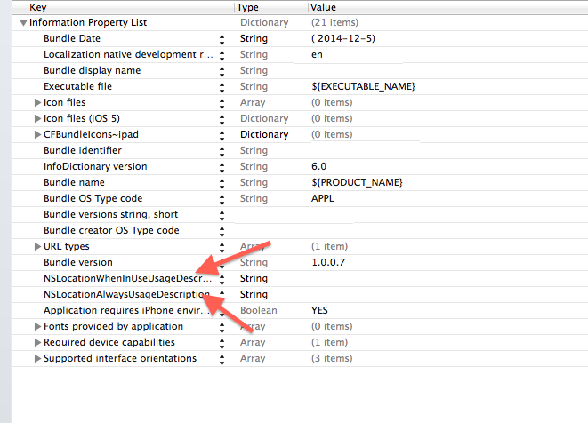

### ios 8 : CCLocationManager

>In iOS 8 you need to do two extra things to get location working: Add a key to your Info.plist and request authorization from the location manager asking it to start. There are two Info.plist keys for the new location authorization. One or both of these keys is required. If neither of the keys are there, you can call startUpdatingLocation but the location manager won’t actually start. It won’t send a failure message to the delegate either (since it never started, it can’t fail). It will also fail if you add one or both of the keys but forget to explicitly request authorization. So the first thing you need to do is to add one or both of the following keys to your Info.plist file:

- **NSLocationWhenInUseUsageDescription**
- **NSLocationAlwaysUsageDescription**

Both of these keys take a string
>which is a description of why you need location services. You can enter a string like “Location is required to find out where you are” which, as in iOS 7, can be localized in the InfoPlist.strings file.

	self.locationManager.delegate = self;
	if(IS_OS_8_OR_LATER){
	    NSUInteger code = [CLLocationManager authorizationStatus];
	    if (code == kCLAuthorizationStatusNotDetermined && ([self.locationManager respondsToSelector:@selector(requestAlwaysAuthorization)] || [self.locationManager respondsToSelector:@selector(requestWhenInUseAuthorization)])) {
	        // choose one request according to your business.
	        if([[NSBundle mainBundle] objectForInfoDictionaryKey:@"NSLocationAlwaysUsageDescription"]){
	            [self.locationManager requestAlwaysAuthorization];
	        } else if([[NSBundle mainBundle] objectForInfoDictionaryKey:@"NSLocationWhenInUseUsageDescription"]) {
	            [self.locationManager  requestWhenInUseAuthorization];
	        } else {
	            NSLog(@"Info.plist does not contain NSLocationAlwaysUsageDescription or NSLocationWhenInUseUsageDescription");
	        }
	    }
	}
	[self.locationManager startUpdatingLocation];
	}
	
	#pragma mark - CLLocationManagerDelegate
	- (void)locationManager:(CLLocationManager *)manager didFailWithError:(NSError *)error
	{
	    NSLog(@"didFailWithError: %@", error);
	    UIAlertView *errorAlert = [[UIAlertView alloc]
	                               initWithTitle:@"Error" message:@"Failed to Get Your Location" delegate:nil cancelButtonTitle:@"OK" otherButtonTitles:nil];
	    [errorAlert show];
	}
	
	- (void)locationManager:(CLLocationManager *)manager didUpdateToLocation:(CLLocation *)newLocation fromLocation:(CLLocation *)oldLocation
	{
	    NSLog(@"didUpdateToLocation: %@", newLocation);
	    CLLocation *currentLocation = newLocation;
	
	    if (currentLocation != nil) {
	        longitudeLabel.text = [NSString stringWithFormat:@"%.8f", currentLocation.coordinate.longitude];
	        latitudeLabel.text = [NSString stringWithFormat:@"%.8f", currentLocation.coordinate.latitude];
	    }
	}