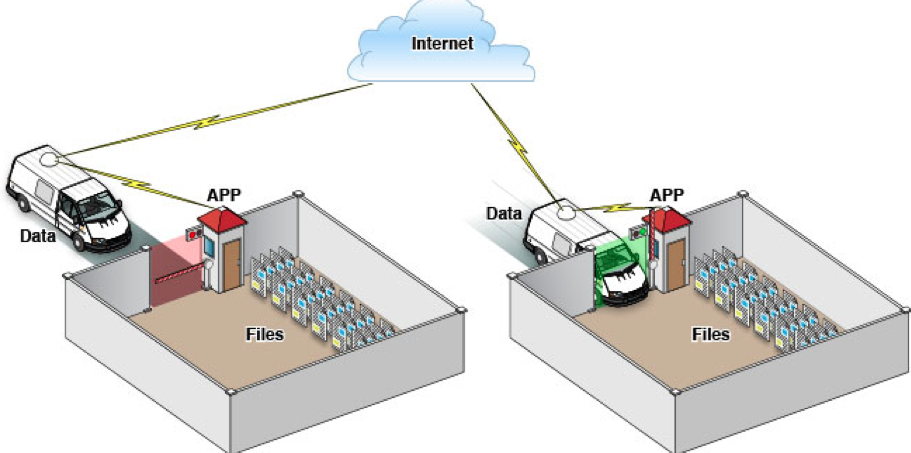
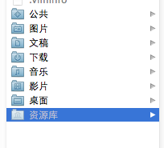
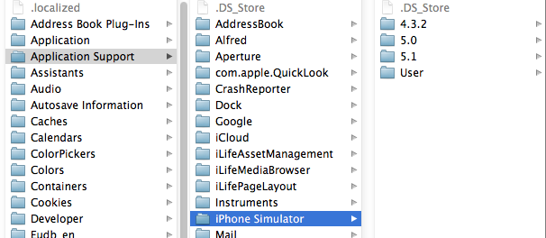
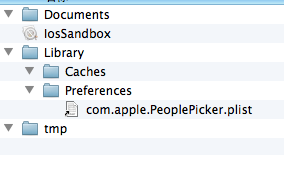
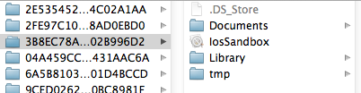

## iOS学习之iOS沙盒(sandbox)机制和文件操作(一)

### 1、iOS沙盒机制
 iOS应用程序只能在为该改程序创建的文件系统中读取文件，不可以去其它地方访问，此区域被成为沙盒，所以所有的非代码文件都要保存在此，例如图像，图标，声音，映像，属性列表，文本文件等。
 
1. 每个应用程序都有自己的存储空间
2. 应用程序不能翻过自己的围墙去访问别的存储空间的内容
3. 应用程序请求的数据都要通过权限检测，假如不符合条件的话，不会被放行。
     
通过这张图只能从表层上理解sandbox是一种安全体系，应用程序的所有操作都要通过这个体系来执行，其中核心内容是：sandbox对应用程序执行各种操作的权限限制。

### 2、打开模拟器沙盒目录
下面看看模拟器的沙盒文件夹在mac电脑上的什么位置。
文件都在个人用户名文件夹下的一个隐藏文件夹里，中文叫资源库，他的目录其实是Library。

1. 方法1、可以设置显示隐藏文件，然后在Finder下直接打开。设置查看隐藏文件的方法如下：打开终端，输入命名
显示Mac隐藏文件的命令：defaults write com.apple.finder AppleShowAllFiles -bool true
隐藏Mac隐藏文件的命令：defaults write com.apple.finder AppleShowAllFiles -bool false
输完单击Enter键，退出终端，重新启动Finder就可以了
重启Finder：鼠标单击窗口左上角的苹果标志-->强制退出-->Finder-->
现在能看到资源库文件夹了。

	

打开资源库后找到/Application Support/iPhone Simulator/文件夹。这里面就是模拟器的各个程序的沙盒目录了。
	

2. 方法2、这种方法更方便，在Finder上点->前往->前往文件夹，输入/Users/username/Library/Application Support/iPhone Simulator/  前往。
username这里写你的用户名。
### 3、目录结构
默认情况下，每个沙盒含有3个文件夹：Documents, Library 和 tmp。因为应用的沙盒机制，应用只能在几个目录下读写文件

- Documents：苹果建议将程序中建立的或在程序中浏览到的文件数据保存在该目录下，iTunes备份和恢复的时候会包括此目录
- Library：存储程序的默认设置或其它状态信息；
- Library/Caches：存放缓存文件，iTunes不会备份此目录，此目录下文件不会在应用退出删除
- tmp：提供一个即时创建临时文件的地方。

**iTunes在与iPhone同步时，备份所有的Documents和Library文件。
iPhone在重启时，会丢弃所有的tmp文件。**

我们创建一个IosSandbox的项目来展开沙盒和文件读写等操作的练习。
创建后找到模拟器上对应的目录，
这是目录全展开了。

这是上面提到的三个目录 ：Documents、Library、 tmp

下篇介绍目录路径获取和文件操作
例子代码：https://github.com/schelling/YcDemo