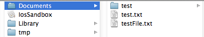

## iOS学习之iOS沙盒(sandbox)机制和文件操作(二)

我们看看如何获取应用程序沙盒目录。包括真机的沙盒的目录。

### 1、获取程序的Home目录

	NSString *homeDirectory = NSHomeDirectory();  
	NSLog(@"path:%@", homeDirectory);  
打印结果:

	2012-06-17 14:00:06.098 IosSandbox[3536:f803] /Users/rongfzh/Library/Application Support/iPhone Simulator/5.1/Applications/3B8EC78A-5EEE-4C2F-B0CB-4C3F02B996D2  

那在真机上的目录有是怎么样的呢？我们看看

	2012-06-17 14:25:47.059 IosSandbox[4281:f803] /var/mobile/Applications/3B8EC78A-5EEE-4C2F-B0CB-4C3F02B996D2
可见，真机上的目录是/var/mobile/Applications/这个目录下的，和模拟器不一样。这个是Home目录，其他的子目录和模拟器一样。

### 2、获取document目录

	NSArray *paths = NSSearchPathForDirectoriesInDomains(NSDocumentDirectory, NSUserDomainMask, YES);  
	NSString *path = [paths objectAtIndex:0];  
	NSLog(@"path:%@", path);  
打印结果

	2012-06-17 14:00:06.099 IosSandbox[3536:f803] path:/Users/rongfzh/Library/Application Support/iPhone Simulator/5.1/Applications/3B8EC78A-5EEE-4C2F-B0CB-4C3F02B996D2/Documents  

### 3、获取Cache目录

	NSArray *paths = NSSearchPathForDirectoriesInDomains(NSCachesDirectory, NSUserDomainMask, YES);  
	NSString *path = [paths objectAtIndex:0];  
	NSLog(@"%@", path);  
打印结果

	2012-06-17 14:03:50.431 IosSandbox[3628:f803] /Users/rongfzh/Library/Application Support/iPhone Simulator/5.1/Applications/3B8EC78A-5EEE-4C2F-B0CB-4C3F02B996D2/Library/Caches  

### 4、获取Library目录

	NSArray *paths = NSSearchPathForDirectoriesInDomains(NSLibraryDirectory, NSUserDomainMask, YES);  
	NSString *path = [paths objectAtIndex:0];  
	NSLog(@"%@", path);  
打印结果 

	2012-06-17 14:07:17.544 IosSandbox[3733:f803] /Users/rongfzh/Library/Application Support/iPhone Simulator/5.1/Applications/3B8EC78A-5EEE-4C2F-B0CB-4C3F02B996D2/Library  

### 5、获取Tmp目录

	NSString *tmpDir = NSTemporaryDirectory();  
	NSLog(@"%@", tmpDir);  
打印结果

	2012-06-17 14:08:07.824 IosSandbox[3782:f803] /var/folders/g7/246bh79130zblw0yjjtc55cw0000gn/T/  

### 6、写入文件

	NSArray *paths = NSSearchPathForDirectoriesInDomains(NSDocumentDirectory, NSUserDomainMask, YES);  
	NSString *docDir = [paths objectAtIndex:0];  
	if (!docDir) {  
	    NSLog(@"Documents 目录未找到");          
	}  
	NSArray *array = [[NSArray alloc] initWithObjects:@"内容",@"content",nil];  
	NSString *filePath = [docDir stringByAppendingPathComponent:@"testFile.txt"];  
	[array writeToFile:filePath atomically:YES];  

注：我们在真机上也运行一下，把文件写入，下一步从真机上把内容读取出来。
写入输入 array ,里面是两个字符串，一会我们读出来打印。
写入我们在程序沙盒目录下看到文件 testFile.txt

打开文件看到的内容是这样的,是个xml格式的plist文件，数据格式保存了内容。

	<?xml version="1.0" encoding="UTF-8"?>  
	<!DOCTYPE plist PUBLIC "-//Apple//DTD PLIST 1.0//EN" "http://www.apple.com/DTDs/PropertyList-1.0.dtd">  
	<plist version="1.0">  
	<array>  
	    <string>内容</string>  
	    <string>content</string>  
	</array>  
	</plist>  
### 7、读取文件

	NSArray *paths = NSSearchPathForDirectoriesInDomains(NSDocumentDirectory, NSUserDomainMask, YES);  
    NSString *docDir = [paths objectAtIndex:0];  
    NSString *filePath = [docDir stringByAppendingPathComponent:@"testFile.txt"];  
    NSArray *array = [[NSArray alloc]initWithContentsOfFile:filePath];  
    NSLog(@"%@", array);  

打印结果：
把上面的文件解析后，把内容打印出来了。

	2012-06-17 14:14:46.249 IosSandbox[3918:f803] (  
	    "\U5185\U5bb9",  
	    content  
	)  
真机上读取并打印文件路径：

	2012-06-17 14:25:47.059 IosSandbox[4281:f803] /var/mobile/Applications/3B8EC78A-5EEE-4C2F-B0CB-4C3F02B996D2/Documents/testFile.txt
	 (
	    "\U5185\U5bb9",
	    content
	)
真机上也能写入和打印。