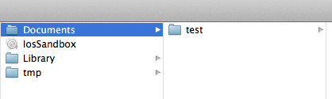
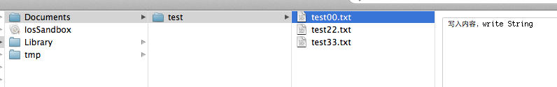
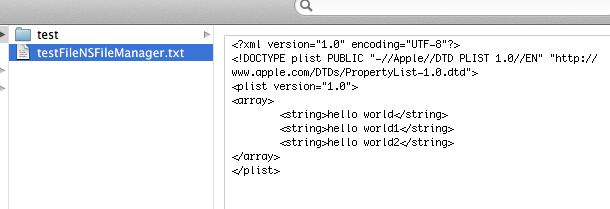
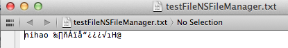

## iOS学习之iOS沙盒(sandbox)机制和文件操作之NSFileManager(三)

我们看看NSFileManager如何使用。包括创建文件，目录，删除，遍历目录等。

### 1、在Documents里创建目录
创建一个叫test的目录,先找到Documents的目录，

	NSArray *paths = NSSearchPathForDirectoriesInDomains(NSDocumentDirectory, NSUserDomainMask, YES);    
    NSString *documentsDirectory = [paths objectAtIndex:0];    
    NSLog(@"documentsDirectory%@",documentsDirectory);    
    NSFileManager *fileManager = [NSFileManager defaultManager];    
    NSString *testDirectory = [documentsDirectory stringByAppendingPathComponent:@"test"];    
    // 创建目录  
    [fileManager createDirectoryAtPath:testDirectory withIntermediateDirectories:YES attributes:nil error:nil];  
启动程序，这时候目录就创建了：

### 2、在test目录下创建文件
创建文件怎么办呢？接着上面的代码 testPath 要用stringByAppendingPathComponent拼接上你要生成的文件名，比如test00.txt。这样才能在test下写入文件。
testDirectory是上面代码生成的路径哦，不要忘了。我往test文件夹里写入三个文件，test00.txt ,test22.txt,text.33.txt。内容都是写入内容，write String。
实现代码如下：

	NSString *testPath = [testDirectory stringByAppendingPathComponent:@"test00.txt"];    
	NSString *testPath2 = [testDirectory stringByAppendingPathComponent:@"test22.txt"];    
	NSString *testPath3 = [testDirectory stringByAppendingPathComponent:@"test33.txt"];    
	  
	  
	NSString *string = @"写入内容，write String";  
	[fileManager createFileAtPath:testPath contents:[string  dataUsingEncoding:NSUTF8StringEncoding] attributes:nil];  
	[fileManager createFileAtPath:testPath2 contents:[string  dataUsingEncoding:NSUTF8StringEncoding] attributes:nil];  
	[fileManager createFileAtPath:testPath3 contents:[string  dataUsingEncoding:NSUTF8StringEncoding] attributes:nil];  
看下面的图，三个文件都出来了，内容也对。

在Documents目录下创建就更简单了，不用加test就ok了
### 3、获取目录列里所有文件名
两种方法获取：subpathsOfDirectoryAtPath 和 subpathsAtPath

	NSArray *paths = NSSearchPathForDirectoriesInDomains(NSDocumentDirectory, NSUserDomainMask, YES);    
	NSString *documentsDirectory = [paths objectAtIndex:0];    
	NSLog(@"documentsDirectory%@",documentsDirectory);    
	NSFileManager *fileManage = [NSFileManager defaultManager];    
	NSString *myDirectory = [documentsDirectory stringByAppendingPathComponent:@"test"];    
	NSArray *file = [fileManage subpathsOfDirectoryAtPath: myDirectory error:nil];   
	NSLog(@"%@",file);    
	NSArray *files = [fileManage subpathsAtPath: myDirectory ];   
	NSLog(@"%@",files);  

获取上面刚才test文件夹里的文件名
打印结果

	2012-06-17 23:23:19.684 IosSandbox[947:f803] fileList:(
	    ".DS_Store",
	    "test00.txt",
	    "test22.txt",
	    "test33.txt"
	)
	2012-06-17 23:23:19.686 IosSandbox[947:f803] fileLit(
	    ".DS_Store",
	    "test00.txt",
	    "test22.txt",
	    "test33.txt"
	)

两个方法都可以，隐藏的文件也打印出来了。
### 4、fileManager使用操作当前目录

	//创建文件管理器  
    NSFileManager *fileManager = [NSFileManager defaultManager];  
    NSArray *paths = NSSearchPathForDirectoriesInDomains(NSDocumentDirectory, NSUserDomainMask, YES);  
    NSString *documentsDirectory = [paths objectAtIndex:0];  
    //更改到待操作的目录下  
    [fileManager changeCurrentDirectoryPath:[documentsDirectory stringByExpandingTildeInPath]];  
    //创建文件fileName文件名称，contents文件的内容，如果开始没有内容可以设置为nil，attributes文件的属性，初始为nil  
    NSString * fileName = @"testFileNSFileManager.txt";  
    NSArray *array = [[NSArray alloc] initWithObjects:@"hello world",@"hello world1", @"hello world2",nil];  
    [fileManager createFileAtPath:fileName contents:array attributes:nil];  
这样就创建了testFileNSFileManager.txt并把三个hello world写入文件了

changeCurrentDirectoryPath目录更改到当前操作目录时，做文件读写就很方便了，不用加上全路径

### 5、删除文件
接上面的代码，remove就ok了。

	[fileManager removeItemAtPath:fileName error:nil];  

### 6、混合数据的读写
用NSMutableData创建混合数据，然后写到文件里。并按数据的类型把数据读出来

1. 写入数据：

		NSString * fileName = @"testFileNSFileManager.txt";  
		NSArray *paths = NSSearchPathForDirectoriesInDomains(NSDocumentDirectory, NSUserDomainMask, YES);  
		NSString *documentsDirectory = [paths objectAtIndex:0];  
		//获取文件路径  
		NSString *path = [documentsDirectory stringByAppendingPathComponent:fileName];  
		//待写入的数据  
		NSString *temp = @"nihao 世界";  
		int dataInt = 1234;  
		float dataFloat = 3.14f;  
		//创建数据缓冲  
		NSMutableData *writer = [[NSMutableData alloc] init];  
		//将字符串添加到缓冲中  
		[writer appendData:[temp dataUsingEncoding:NSUTF8StringEncoding]];     
		//将其他数据添加到缓冲中  
		[writer appendBytes:&dataInt length:sizeof(dataInt)];  
		[writer appendBytes:&dataFloat length:sizeof(dataFloat)];    
		//将缓冲的数据写入到文件中  
		[writer writeToFile:path atomically:YES];  

我们看看数据怎么样了：

我们看到后面的是乱码，那是中文被转成了NSData后，还有int float的二进制

2. 读取刚才写入的数据：

		//读取数据：  
	    int intData;  
	    float floatData = 0.0;  
	    NSString *stringData;  
	     
	    NSData *reader = [NSData dataWithContentsOfFile:path];  
	    stringData = [[NSString alloc] initWithData:[reader subdataWithRange:NSMakeRange(0, [temp length])]  
	                                  encoding:NSUTF8StringEncoding];  
	    [reader getBytes:&intData range:NSMakeRange([temp length], sizeof(intData))];  
	    [reader getBytes:&floatData range:NSMakeRange([temp length] + sizeof(intData), sizeof(floatData))];  
	    NSLog(@"stringData:%@ intData:%d floatData:%f", stringData, intData, floatData);  

打印出来的结果：
	2012-06-17 23:51:14.723 IosSandbox[1285:f803] stringData:nihao hello! intData:1234332 floatData:3.140000
这里把写入的汉字改成了 hello。因为[temp length]算长度是，把中文算成一位了，出来的结果有误。