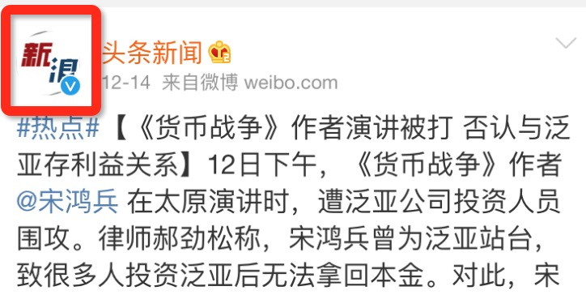
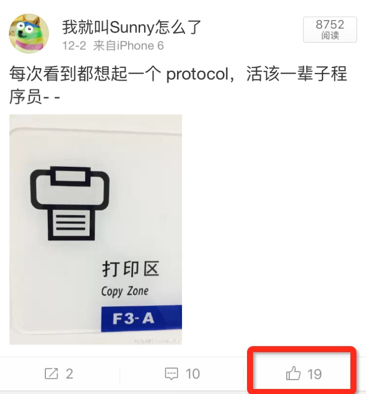

# iOS 开发中的 Self-Manager 模式
Self-Manager 源于我们团队内部的黑话，“诶？你刚去的创业公司有几个 iOS 开发啊？” “就我一个” “靠，你这是 Self-Manager 啊”

最近，这个思路被我们当做了一种设计模式，即赋予一个 Widget 更大的权利，让其自己负责自己的事件。
举个简单的栗子，这种负责展示头像的视图：

它的职责包括：

1. 通过传入的 URL，加载并展示头像图片
2. 显示一些附属信息，比如大V的标志
3. 将用户点击头像的事件传递给外层的 View Controller 跳转到用户信息页面

于是乎这个 Widget 的 API 可以长这个样子：

	@interface FDAvatarView : UIView
	// 假设 VIPInfo 是某个 Entity
	- (void)configureWithAvatarURL:(NSURL *)URL VIPInfo:(id)info tapped:(void (^)(void))block;
	@end

使用这个控件的人只需要调用这个 configure 方法就可以配置入参和事件处理。但随之而来的就是一些蛋疼的问题：

configure 的调用者是 superview，上面的例子中也就是一个 UITableViewCell，但 Cell 这层并不知道自己的 ViewController 是谁，于是乎还得向上一级传递这个点击事件，直到能获取到 NavigationController，然后 Push 一个用户信息的页面。
这个 Avatar View 在 App 的各个地方都可能粗线，而且行为一致，那就意味着事件处理的 block，要散落在各个页面中，同时也带来了很多“只是为向上一层级转发事件”的 “Middle Man”
为解决这个问题，就需要给这个 View 放权，让其自己 Handle 自己的事件，也就是 Self-Managed，为了不破坏 View 的纯洁性，比较好的实践是在 Category 中实现：

	@interface FDAvatarView (FDAvatarViewSelfManager)
	- (void)selfManagedConfigureWithAvatarURL:(NSURL *)URL VIPInfo:(id)info uid:(NSString *)uid;
	@end

实现时最好要调用 View 主类提供的 API：

	@implementation FDAvatarView (FDAvatarViewSelfManager)
	// 为后一个页面的创建增加了个 UID 参数
	- (void)selfManagedConfigureWithAvatarURL:(NSURL *)URL VIPInfo:(id)info UID:(NSString *)UID {
	    [self configureWithAvatarURL:URL VIPInfo:info tapped:^{
	    	// 假设 App 结构是 Root -> TabBar -> Navigation -> ViewController
	        UITabBarController *tabBarControler = (id)[UIApplication.sharedApplication.delegate.window.rootViewController;
	        UINavigationController *navigationController = tabBarControler.selectedViewController;
	        // 创建用户信息 View Controller
	        FDUserProfileViewController *profileViewController = [FDUserProfileViewController viewControllerWithUID:UID];
	        [navigationController pushViewController:profileViewController animated:YES];
	    }];
	}
	@end

这里用到了类似 AOP 的思路，添加了对 App 层级的耦合，如果觉得这样的耦合方式不妥的话，也可以封装个全局方法去取到当前顶层的 Navigation Controller。
这样，FDAvatarView 的调用者只需要配置入参，其余的它自己全能搞定了，即使 App 内很多处出现头像，逻辑代码也只有一份。

接下来再来个例子：

这个点赞的按钮功能上有几个职责：

1. 显示已有的点赞数
2. 点击按钮后执行一个小动画，点赞数 +1，同时发送网络请求。
3. 若已经点赞，点击执行反向操作
4. 若网络请求发送失败，则回退成点击前的状态

这个控件的 API 可以设计成这样：

	@interface FDLikeButton : UIButton
	- (void)configureLikeStatus:(BOOL)likeOrNot count:(NSInteger)count animated:(BOOL)animated;
	@end

因为继承自 UIButton，所以外部可以直接设置其 action，就不增加 tappedHandler 的参数了。外部在点击事件中需要调用这个配置方法，播放点赞动画，紧接着发送一个网络请求，若网络请求失败，可以再次调用这个 API 的无动画版本回滚状态。但像上一个例子一样，网络请求和事件处理逻辑相同，但代码却分部在各个页面中，于是给这个 View 增加 Self-Managed 模式的 Category：

	@interface FDLikeButton (FDLikeButtonSelfManager)
	- (void)selfManagedConfigureWithLikeStatus:(BOOL)likeOrNot count:(NSInteger)count;
	@end

伪代码的实现如下：

	@implementation FDLikeButton (FDLikeButtonSelfManager)
	- (void)selfManagedConfigureWithLikeStatus:(BOOL)likeOrNot count:(NSInteger)count {
	    [self configureLikeStatus:likeOrNot count:count animated:NO];
	    [self addTarget:self action:@selector(likeButtonTapped:) forControlEvents:UIControlEventTouchUpInside];
	}
	- (void)likeButtonTapped:(id)sender {
	    // +1 or -1 with animation
	    // Network request ^(NSError *error) {
	    //     if (error) {
	    //         rollback
	    //     }
	    // }
	}
	@end

程序的复杂度并不会因哪种酷炫的设计模式所减少，能做到的只是对复杂度的切分和控制，即：

让一大坨恶心的代码变成几小坨不那么恶心的代码。
让恶心的代码只在一个地方恶心。
Self-Manager 模式我们实践的时候写起来很开心，抛砖引玉一下，希望也能解决你的苦恼。

