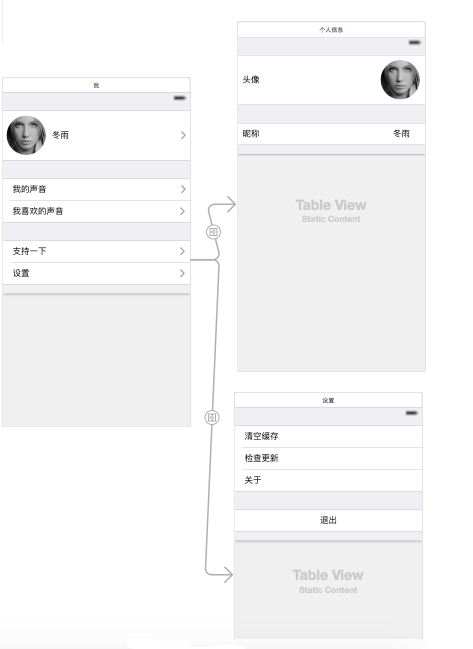
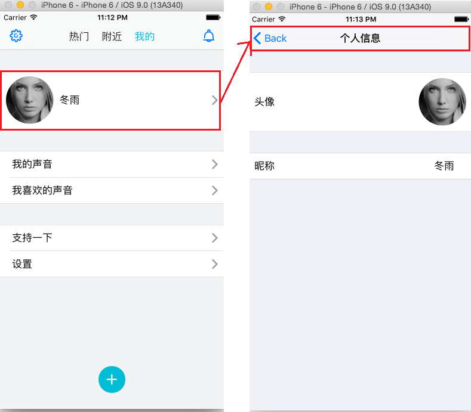
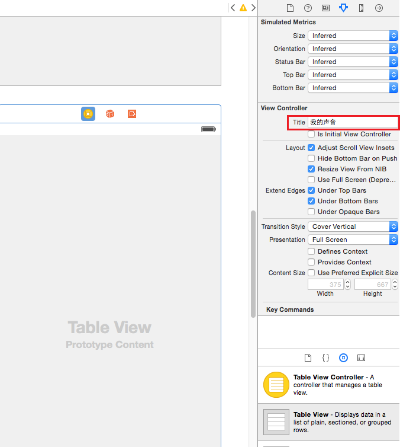

## ChildViewController

### 1. 添加子视图及控制器
1. ProfileViewController使用Storyboard来设计，需要将其添加到MainViewController的scrollView中作为一个childView.

		// MainViewController
	    
		// ...
		// other childview

		// Get ProfileViewController's instance from storyboard
	    UIStoryboard *storyboard = [UIStoryboard storyboardWithName:@"Login" bundle:nil];
	    RDPMineTableViewController *profileViewController = [storyboard instantiateViewControllerWithIdentifier:@"RDPMineTableViewController"];
		
		// Get tis tableView by property tableView
	    UITableView *profileView = profileViewController.tableView;
	
		// **Important**, add profileViewController as childViewController of self
		// otherwise, it will break out by drag.
	    [self addChildViewController:profileViewController];
	    
	    [self.faceViews addObject:profileView];
	    
		// Set up childView's
	    [self setupPages:self.faceViews];

### 2. 问题：表视图的背景一直是黑色，修改tableView的backgroundView才可以
	
	// ProfileViewController.m
	- (void)viewDidLoad {
	    [super viewDidLoad];
	    
		// ** Important **
		// ** Set backgroundView for current tableView, otherwise don't work at all!**
	    UIView *backgroundView = [UIView new];
	    backgroundView.backgroundColor = [UIColor raindropWhiteGreyBgColor];
	    [self.tableView setBackgroundView:backgroundView];
	}

### 3. 表视图的push怎么办？答：直接在storyboard中连接即可
已经将ProfileViewcontroller的navigationController取消了，但是还是需要push才能显示里面的控制器啊。
尝试现在storyboard中直接连接push，运行竟然可以！ 被push的Controller自动寻找父控制器，并推送出去！美哉！

1. Storyboard中连接

	

2. 实际运行时

	

### 4. 怎么设置navigation的title呢？当前没有NavigationBar了呀

1. 在代码中设置title属性
	
	self.title = @"xxx";

2. Storyboard中，找到属性title，直接设置即可。
	